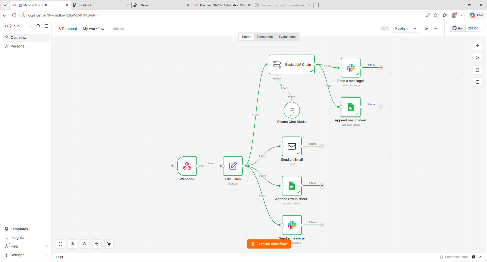
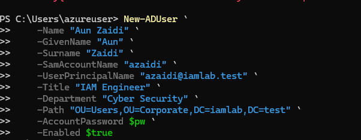
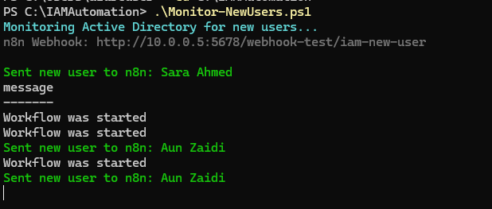
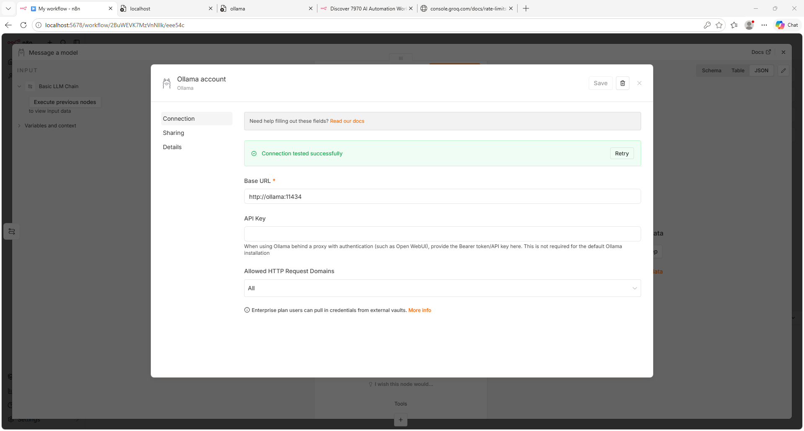
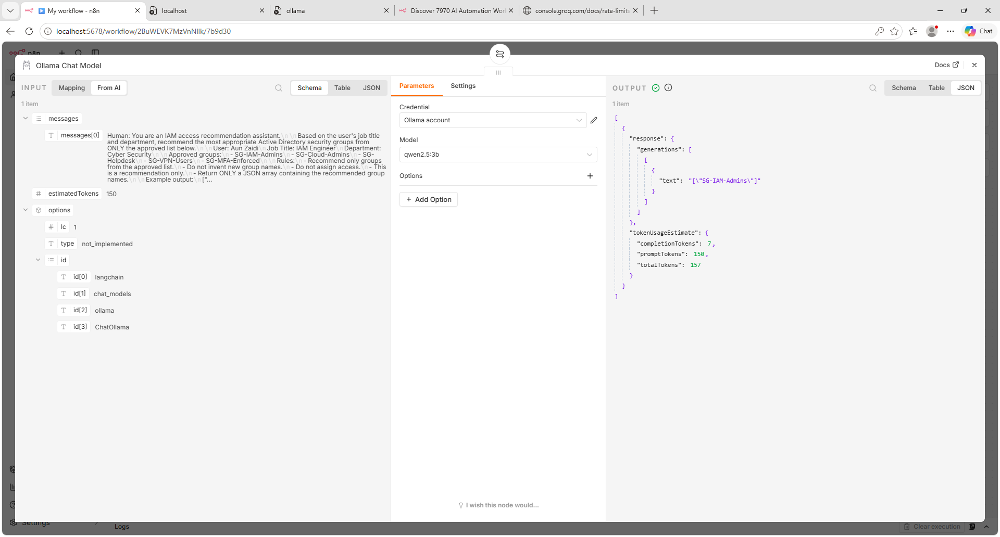
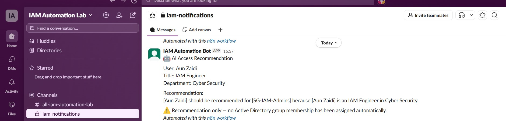
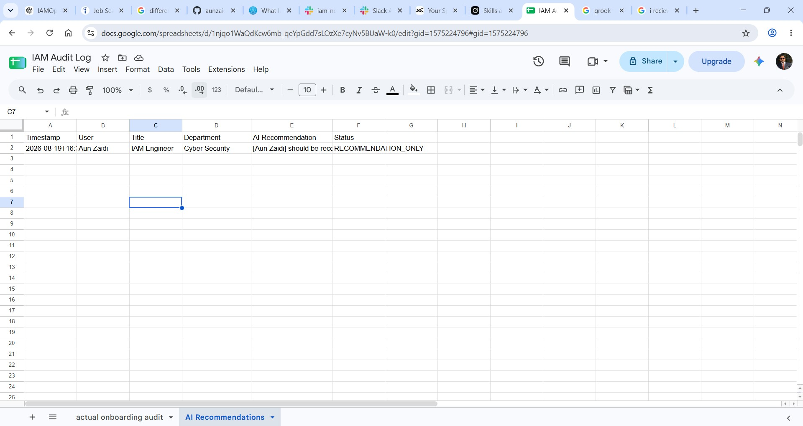
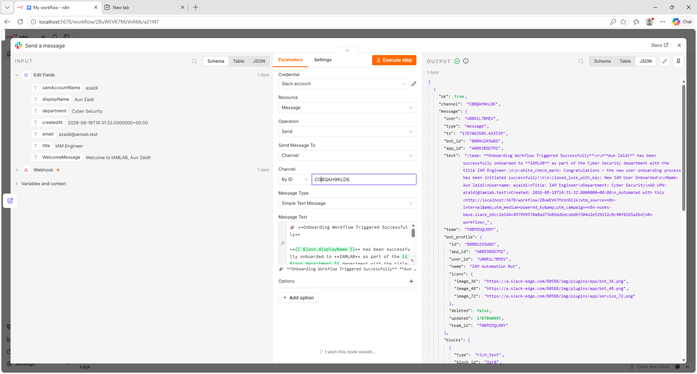
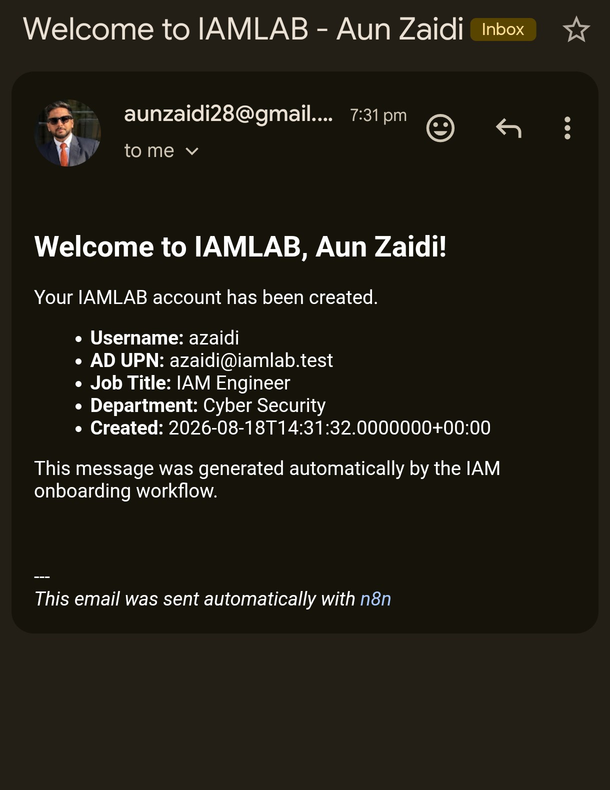
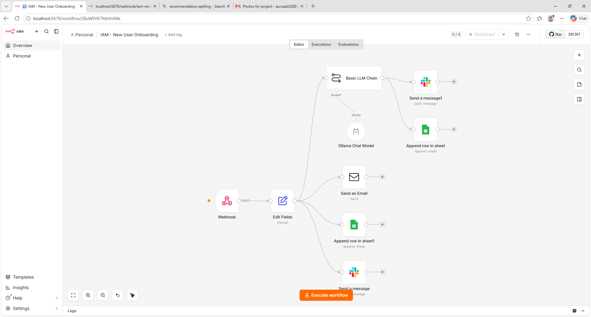

# IAM User Onboarding Automation with n8n

An end-to-end IAM automation lab that detects newly created Active Directory users and triggers an n8n workflow for onboarding notifications, audit logging, and AI-assisted access recommendations.

The solution integrates **Active Directory, PowerShell, n8n, Docker, Slack, Google Sheets, Gmail, and a locally hosted Ollama/Qwen2.5 model**.

> The AI component is recommendation-only and does not automatically grant Active Directory group membership.



## Architecture

The lab was built on **Microsoft Azure** using two virtual machines placed inside the **same Virtual Network (VNet)** so that the domain controller and automation server could communicate over private IP addresses.

- **DC01 – Windows Server 2025**
  - Active Directory Domain Services
  - DNS
  - PowerShell user monitoring
  - Domain: `iamlab.test`

- **N8N01 – Ubuntu Server 24.04**
  - Docker
  - n8n
  - Ollama
  - Qwen2.5:3b

Both VMs were configured in the same Azure VNet/subnet.  
This allowed DC01 to send webhook requests directly to the n8n server over the internal Azure network instead of exposing the workflow endpoint publicly.
```text
Azure VNet
│
├── DC01 - Windows Server
│   ├── Active Directory
│   ├── DNS
│   └── PowerShell Monitor
│
│        HTTP POST over private network
│                    ↓
│
└── N8N01 - Ubuntu Server
    ├── Docker
    ├── n8n
    └── Ollama / Qwen2.5
```
## Workflow

1. A new user is created in **Active Directory** with attributes such as username, UPN, job title, department, and creation time.

2. A **PowerShell monitoring script** on DC01 checks Active Directory for newly created users and converts the relevant attributes into JSON.

3. The script sends the payload to the **published n8n production webhook** running on N8N01.

4. n8n normalizes the incoming user data and triggers several onboarding actions:

   - Sends a welcome email through Gmail
   - Sends an onboarding notification to Slack
   - Appends an onboarding audit record to Google Sheets
   - Sends the user's title and department to the local Ollama model
   - Generates an AI-based AD group recommendation
   - Sends the recommendation to Slack
   - Records the AI recommendation in Google Sheets

The workflow was tested using actual Active Directory user creation events rather than only manually generated webhook payloads.

### Active Directory User



### PowerShell Detection



## AI Recommendation Layer

To avoid automatically assigning permissions based on an LLM response, the AI component was designed as a **recommendation-only layer**.

n8n sends the user's job title and department to a locally hosted **Ollama** instance running the **Qwen2.5:3b** model.

The model evaluates the user against a controlled list of Active Directory groups:

- `SG-IAM-Admins`
- `SG-Cloud-Admins`
- `SG-Helpdesk`
- `SG-VPN-Users`
- `SG-MFA-Enforced`

The recommendation is then sent to Slack and recorded in Google Sheets for review.

No Active Directory group membership is changed automatically.

### Ollama Integration



### AI Recommendation Output



### Recommendation in Slack



### Recommendation Audit in Google Sheets



## Challenges & Troubleshooting

Several issues came up while building the lab and required changes to the original design.

### External AI API Restrictions

The first plan was to use an external AI provider for group recommendations.

- **OpenAI** required separate API billing, so it was not used for the final lab.
- **Google Gemini** returned a location restriction when requests originated from the Azure-hosted automation VM in the East Asia/Hong Kong environment.
- **Groq** returned HTTP `403 Forbidden` from the Azure VM, while the same API key successfully worked from another machine.

Instead of depending on an external AI API, the workflow was redesigned to run **Ollama locally with Qwen2.5:3b** inside Docker.

This removed the external API dependency and allowed n8n to communicate with the model directly over the Docker network.

### n8n Encryption Key After VM Restart

After restarting the Azure VM, n8n initially failed because the encryption key configured in Docker did not match the key stored in the existing persistent n8n data volume.

The persistent volume was preserved and the Docker configuration was corrected so n8n could continue using its existing encryption configuration without losing workflows or credentials.

### Test vs Production Webhooks

During development, n8n used:

```text
/webhook-test/iam-new-user

## Security & Production Considerations

This lab was designed to prove the IAM automation flow, not to represent a fully production-hardened deployment.

For a production implementation, I would add:

- HTTPS for webhook traffic
- Webhook authentication or request signing
- Network restrictions using NSGs/firewall rules
- Persistent AD event checkpointing to prevent missed or duplicate events
- Retry logic and centralized error handling
- Centralized logging / SIEM integration
- Secret storage instead of local environment files
- Approval workflows before privileged access is assigned
- A `NO_MATCH` path for AI recommendations
- Deterministic role-to-group mappings for sensitive access

The AI layer should remain advisory only, with access decisions enforced through IAM policy and approval controls.
```

## Repository Structure

```text
iam-n8n-user-onboarding/
├── docker/
│   ├── compose.yaml
│   └── .env.example
├── n8n/
│   └── IAM-New-User-Onboarding.json
├── powershell/
│   └── Monitor-NewUsers.ps1
├── samples/
│   └── new-user-payload.json
├── screenshots/
└── .gitignore
```

## Results

The completed lab successfully demonstrated an end-to-end IAM onboarding event triggered from a real Active Directory user creation.

The published workflow successfully:

- Detected the new AD account through PowerShell
- Triggered the n8n production webhook
- Sent the welcome email
- Sent the onboarding notification to Slack
- Logged the onboarding event in Google Sheets
- Generated an Ollama/Qwen access recommendation
- Sent the AI recommendation to Slack
- Logged the AI recommendation in Google Sheets

### Slack Onboarding Notification



### Welcome Email



### Published Workflow Execution



---

This project was built as a hands-on IAM automation lab to explore identity lifecycle automation, workflow orchestration, AI-assisted access recommendations, and the practical limitations encountered when moving from a proof of concept toward a production-ready design.
