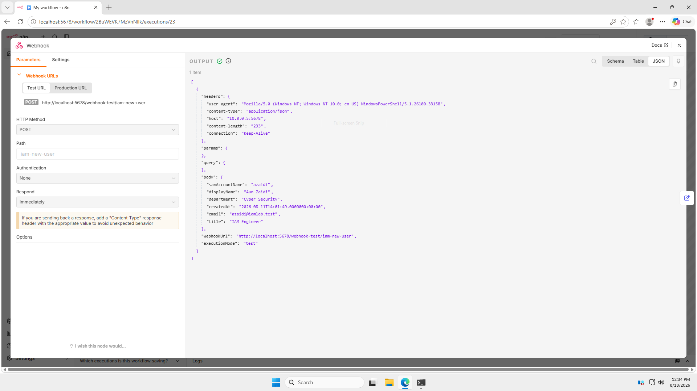
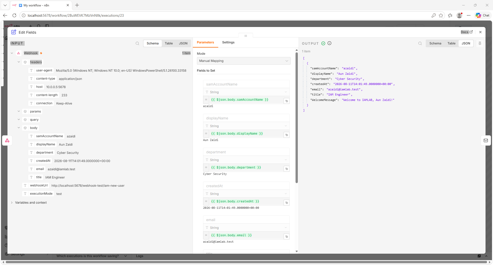
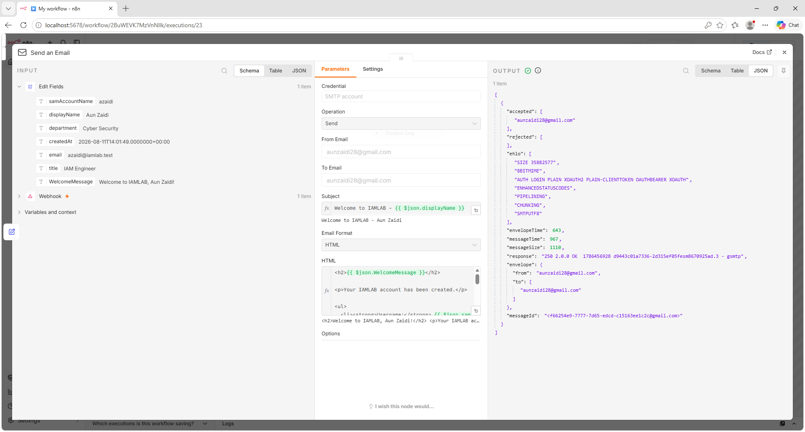
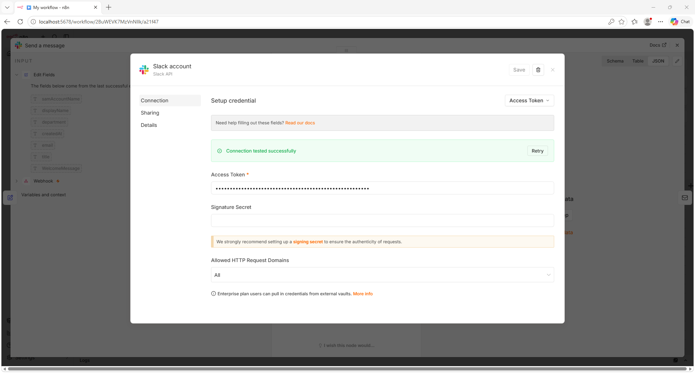
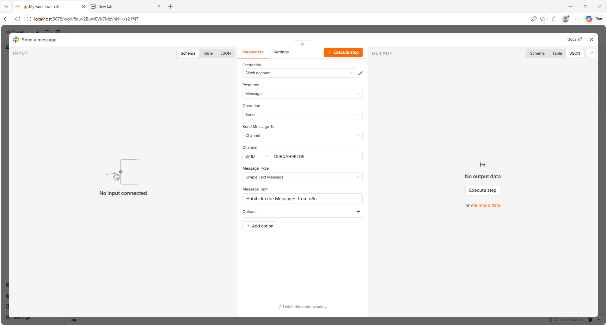
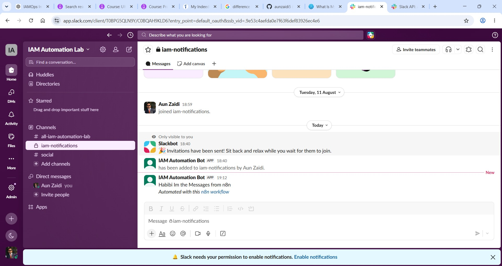
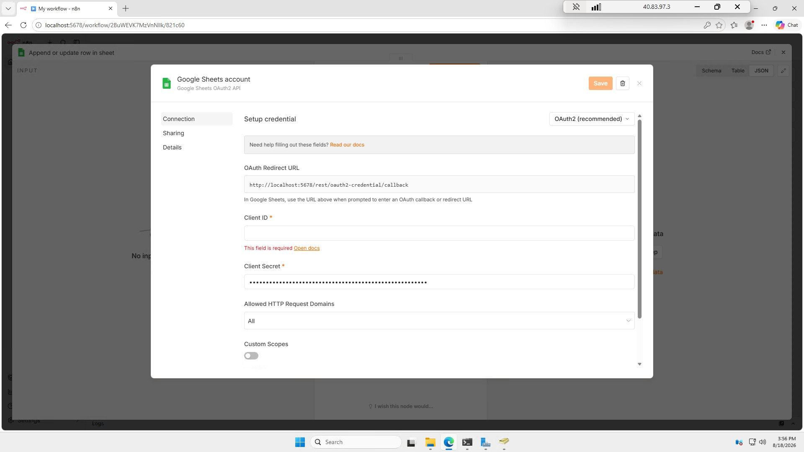
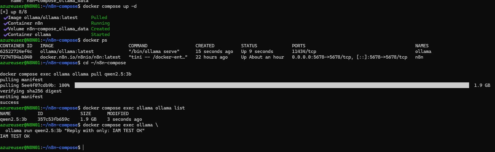

# IAM User Onboarding Automation with n8n

An end-to-end IAM automation lab that detects newly created Active Directory users and triggers an n8n workflow for onboarding notifications, audit logging, and AI-assisted access recommendations.

The solution integrates **Active Directory, PowerShell, n8n, Docker, Slack, Google Sheets, Gmail, and a locally hosted Ollama/Qwen2.5 model**.

> The AI component is recommendation-only and does not automatically grant Active Directory group membership.


## Architecture

The lab was built on **Microsoft Azure** using two virtual machines placed inside the **same Virtual Network (VNet)** so that the domain controller and automation server could communicate over private IP addresses.

- **DC01 – Windows Server 2025**
  - Active Directory Domain Services
  - DNS
  - PowerShell user monitoring
  - Domain: `iamlab.test`

- **N8N01 – Ubuntu Server 24.04**
  - Docker
  - n8n
  - Ollama
  - Qwen2.5:3b

Both VMs were configured in the same Azure VNet/subnet.  
This allowed DC01 to send webhook requests directly to the n8n server over the internal Azure network instead of exposing the workflow endpoint publicly.
```text
Azure VNet
│
├── DC01 - Windows Server
│   ├── Active Directory
│   ├── DNS
│   └── PowerShell Monitor
│
│        HTTP POST over private network
│                    ↓
│
└── N8N01 - Ubuntu Server
    ├── Docker
    ├── n8n
    └── Ollama / Qwen2.5
```
## Implementation Walkthrough

### 1. Complete n8n Workflow

The final workflow combines Active Directory user detection, onboarding notifications, audit logging, and AI-assisted access recommendations into one automation.


---

### 2. n8n Webhook Trigger

A POST webhook was created in n8n to receive newly created Active Directory user information from the PowerShell monitoring script running on DC01.

The final implementation uses the published production webhook rather than the temporary test webhook.



---

### 3. Transforming Active Directory Attributes

The incoming webhook payload contains attributes collected directly from Active Directory.

The Edit Fields node normalizes the information used by the rest of the workflow, including:

- Username
- Display name
- UPN
- Job title
- Department
- Account creation time
- Welcome message



---

### 4. Welcome Email Automation

After the user information is processed, n8n sends an automated welcome email.

Because the lab domain `iamlab.test` does not provide real mailboxes, an external Gmail mailbox was used to validate the email workflow.



---

### 5. Slack Authentication

A Slack bot application was integrated with n8n and authenticated so the workflow could send IAM onboarding notifications into the private IAM notification channel.



---

### 6. Initial Slack Integration Test

Before connecting Slack to the full onboarding workflow, a standalone message was sent from n8n to verify that the bot token, channel configuration, and API permissions were working correctly.



---

### 7. Slack Message Successfully Received

The test message successfully appeared in Slack, confirming communication between n8n and the Slack workspace.



---

### 8. Google Sheets Authentication

Google OAuth authentication was configured in n8n so onboarding and AI recommendation events could be written into Google Sheets as an audit trail.



---

### 9. Dynamic IAM Onboarding Notification

Once Slack integration was verified, the Slack node was connected to the actual onboarding workflow.

The notification dynamically includes the new user's identity attributes received from Active Directory.


---

### 10. Active Directory Test User

A real user account was created inside the `iamlab.test` Active Directory domain to test the workflow end-to-end.

The test account included job title and department information so those attributes could also be passed into the automation.


---

### 11. PowerShell Detecting the New AD User

The PowerShell monitoring script running on DC01 detected the newly created Active Directory account and sent the user's attributes as JSON to the n8n webhook running on N8N01.

This proved the workflow was triggered from an actual Active Directory event rather than only through manually submitted test data.


---

### 12. Adding Local AI with Ollama

External AI APIs were initially evaluated for the access recommendation component.

After API billing and execution-region/network restrictions were encountered, Ollama was deployed locally alongside n8n using Docker.



---

### 13. Ollama Connected to n8n

The local Ollama instance was connected to n8n through the Docker network.

n8n communicates with Ollama internally rather than exposing the Ollama service publicly.


---

### 14. AI-Based Group Recommendation

The user's job title and department are passed to the locally hosted Qwen2.5 model.

The model evaluates the identity against a controlled list of Active Directory security groups and produces a recommendation with a short explanation.

The AI output is advisory only and does not modify Active Directory membership.


---

### 15. AI Recommendation Sent to Slack

The recommendation generated by Ollama is sent to Slack so the IAM or IT team can review the suggested access.

The Slack message clearly identifies the result as a recommendation rather than an automatic access assignment.


---

### 16. AI Recommendation Audit Trail

The same AI recommendation is written into Google Sheets to maintain a separate record of the recommendation generated for the user.


---

### 17. Welcome Email Successfully Received

The welcome email generated by the workflow was successfully delivered, validating the email branch of the onboarding automation.


---

### 18. Published Production Workflow

The final workflow was published in n8n and switched from the temporary test endpoint to the production webhook.

This allows newly created Active Directory users to trigger the automation without manually enabling the n8n test listener.

The production workflow successfully executed the onboarding and AI recommendation branches.


## Workflow

1. A new user is created in **Active Directory** with attributes such as username, UPN, job title, department, and creation time.

2. A **PowerShell monitoring script** on DC01 checks Active Directory for newly created users and converts the relevant attributes into JSON.

3. The script sends the payload to the **published n8n production webhook** running on N8N01.

4. n8n normalizes the incoming user data and triggers several onboarding actions:

   - Sends a welcome email through Gmail
   - Sends an onboarding notification to Slack
   - Appends an onboarding audit record to Google Sheets
   - Sends the user's title and department to the local Ollama model
   - Generates an AI-based AD group recommendation
   - Sends the recommendation to Slack
   - Records the AI recommendation in Google Sheets

The workflow was tested using actual Active Directory user creation events rather than only manually generated webhook payloads.

### Active Directory User


### PowerShell Detection


## AI Recommendation Layer

To avoid automatically assigning permissions based on an LLM response, the AI component was designed as a **recommendation-only layer**.

n8n sends the user's job title and department to a locally hosted **Ollama** instance running the **Qwen2.5:3b** model.

The model evaluates the user against a controlled list of Active Directory groups:

- `SG-IAM-Admins`
- `SG-Cloud-Admins`
- `SG-Helpdesk`
- `SG-VPN-Users`
- `SG-MFA-Enforced`

The recommendation is then sent to Slack and recorded in Google Sheets for review.

No Active Directory group membership is changed automatically.

### Ollama Integration


### AI Recommendation Output


### Recommendation in Slack


### Recommendation Audit in Google Sheets


## Challenges & Troubleshooting

Several issues came up while building the lab and required changes to the original design.

### External AI API Restrictions

The first plan was to use an external AI provider for group recommendations.

- **OpenAI** required separate API billing, so it was not used for the final lab.
- **Google Gemini** returned a location restriction when requests originated from the Azure-hosted automation VM in the East Asia/Hong Kong environment.
- **Groq** returned HTTP `403 Forbidden` from the Azure VM, while the same API key successfully worked from another machine.

Instead of depending on an external AI API, the workflow was redesigned to run **Ollama locally with Qwen2.5:3b** inside Docker.

This removed the external API dependency and allowed n8n to communicate with the model directly over the Docker network.

### n8n Encryption Key After VM Restart

After restarting the Azure VM, n8n initially failed because the encryption key configured in Docker did not match the key stored in the existing persistent n8n data volume.

The persistent volume was preserved and the Docker configuration was corrected so n8n could continue using its existing encryption configuration without losing workflows or credentials.

### Test vs Production Webhooks

During development, n8n used:

```text
/webhook-test/iam-new-user
```

## Security & Production Considerations

This lab was designed to prove the IAM automation flow, not to represent a fully production-hardened deployment.

For a production implementation, I would add:

- HTTPS for webhook traffic
- Webhook authentication or request signing
- Network restrictions using NSGs/firewall rules
- Persistent AD event checkpointing to prevent missed or duplicate events
- Retry logic and centralized error handling
- Centralized logging / SIEM integration
- Secret storage instead of local environment files
- Approval workflows before privileged access is assigned
- A `NO_MATCH` path for AI recommendations
- Deterministic role-to-group mappings for sensitive access

The AI layer should remain advisory only, with access decisions enforced through IAM policy and approval controls.

## Repository Structure

```text
iam-n8n-user-onboarding/
├── docker/
│   ├── compose.yaml
│   └── .env.example
├── n8n/
│   └── IAM-New-User-Onboarding.json
├── powershell/
│   └── Monitor-NewUsers.ps1
├── samples/
│   └── new-user-payload.json
├── screenshots/
└── .gitignore
```

## Results

The completed lab successfully demonstrated an end-to-end IAM onboarding event triggered from a real Active Directory user creation.

The published workflow successfully:

- Detected the new AD account through PowerShell
- Triggered the n8n production webhook
- Sent the welcome email
- Sent the onboarding notification to Slack
- Logged the onboarding event in Google Sheets
- Generated an Ollama/Qwen access recommendation
- Sent the AI recommendation to Slack
- Logged the AI recommendation in Google Sheets

### Slack Onboarding Notification


### Welcome Email


### Published Workflow Execution


---

This project was built as a hands-on IAM automation lab to explore identity lifecycle automation, workflow orchestration, AI-assisted access recommendations, and the practical limitations encountered when moving from a proof of concept toward a production-ready design.
