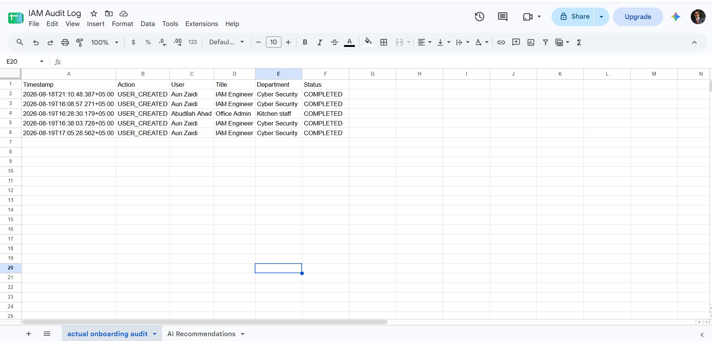

# IAM User Onboarding Automation with n8n

An end-to-end IAM automation lab that detects newly created Active Directory users and automatically triggers onboarding notifications, audit logging, and AI-assisted access recommendations.

The solution integrates **Microsoft Azure, Active Directory, PowerShell, n8n, Docker, Slack, Google Sheets, Gmail, and a locally hosted Ollama/Qwen2.5 model**.

> **IAM safety boundary:** The AI component is recommendation-only. It does not automatically modify Active Directory group membership.


---

## Architecture

The lab was deployed on **Microsoft Azure** using two virtual machines.

### DC01 — Windows Server 2025

- Active Directory Domain Services
- DNS
- PowerShell monitoring
- Domain: `iamlab.test`

### N8N01 — Ubuntu Server 24.04

- Docker
- n8n
- Ollama
- Qwen2.5:3b

Both virtual machines were placed inside the **same Azure VNet and subnet**, allowing them to communicate using private networking.

This allowed the Domain Controller to send webhook requests directly to the n8n server without exposing the automation endpoint publicly.

```text
                         Microsoft Azure
                              │
                        Azure VNet/Subnet
                              │
              ┌───────────────┴───────────────┐
              │                               │
      DC01 - Windows Server            N8N01 - Ubuntu
              │                               │
      Active Directory                   Docker
      DNS                                ├── n8n
      PowerShell Monitor                 └── Ollama
              │                               │
              └──── HTTP POST / Webhook ─────┘
```

---

# Implementation Walkthrough

## 1. Building the n8n Workflow

The final n8n workflow was designed to receive identity information from Active Directory and branch into several onboarding actions.

The completed workflow handles:

- Welcome email
- Slack onboarding notification
- Google Sheets onboarding audit
- AI-based access recommendation
- AI recommendation notification to Slack
- AI recommendation audit in Google Sheets

The complete workflow is shown at the top of this README.

---

## 2. Creating the n8n Webhook

A **POST webhook** was created in n8n to receive newly created Active Directory user information from DC01.


During development, the workflow initially used:

```text
/webhook-test/iam-new-user
```

The test endpoint requires n8n to manually listen for a test event.

For the final implementation, the workflow was published and moved to:

```text
/webhook/iam-new-user
```

This allowed new Active Directory users to trigger the workflow automatically without manually starting the webhook listener.

---

## 3. Transforming Active Directory Data

The webhook receives identity attributes collected from Active Directory.

The **Edit Fields** node normalizes the data before it is passed to the rest of the workflow.

The workflow uses attributes such as:

- `samAccountName`
- Display name
- UPN
- Job title
- Department
- Account creation time
- Welcome message


---

## 4. Configuring the Welcome Email

The next branch sends an automated welcome email containing information about the newly created account.


The lab uses the internal domain:

```text
iamlab.test
```

Because this domain does not provide real public mailboxes, an external Gmail mailbox was used to validate email delivery.

---

## 5. Connecting Slack to n8n

A Slack application and bot were created and connected to n8n so IAM onboarding events could be sent to a private notification channel.


Before connecting Slack to the real onboarding workflow, I first tested the integration independently.


The test message was successfully received in Slack, confirming that the bot token, permissions and channel configuration were working correctly.


After validating the integration, the Slack node was connected to the actual IAM onboarding workflow.

---

## 6. Connecting Google Sheets

Google OAuth authentication was configured inside n8n so onboarding events could be written to Google Sheets.


Google Sheets was used as a lightweight audit trail for the lab.

The onboarding sheet records information such as:

```text
Timestamp
Action
User
Title
Department
Status
```

A second sheet is used later in the workflow to record AI-generated access recommendations.

---

## 7. Creating a Real Active Directory Test User

Instead of testing the workflow only with manually generated webhook data, a real user was created inside the `iamlab.test` Active Directory domain.

The account included identity attributes such as job title and department so they could be passed through the full automation.


---

## 8. Detecting New Users with PowerShell

A PowerShell monitoring script runs on DC01 and checks Active Directory for newly created user accounts.

When a new account is detected, the script collects the required attributes, converts them into JSON and sends them to the n8n production webhook running on N8N01.


This proved the workflow was triggered from an **actual Active Directory user creation event**.

### PowerShell troubleshooting

An early version of the script printed a success message even when the webhook returned an HTTP error.

The script was improved using `try/catch` handling so failed webhook requests are reported correctly instead of appearing as successful executions.

The public GitHub version also avoids hard-coding the n8n server address and accepts the webhook URL as configuration.

---

# 9. Adding AI Access Recommendations

The next objective was to use AI to recommend an appropriate Active Directory security group based on the user's job title and department.

Before using Ollama, several external AI options were tested.

### OpenAI

OpenAI required separate API billing, which is independent from a ChatGPT subscription.

For this lab, I wanted to avoid introducing a paid API dependency.

### Google Gemini

Gemini was then tested from the Azure-hosted N8N01 server.

The API returned a location restriction:

```text
User location is not supported for the API use.
```

The automation VM was running in the **Azure East Asia environment (Hong Kong)**.

### Groq

Groq was also tested.

The same Groq API key successfully returned models from another machine, but requests originating from the Azure VM returned:

```text
403 Forbidden
```

This helped isolate the problem to the execution environment/network path rather than the n8n workflow itself.

### Moving to Local AI

Instead of continuing to depend on external AI APIs, the design was changed to run AI locally.

**Ollama** was deployed alongside n8n using Docker.


The **Qwen2.5:3b** model was downloaded and tested successfully.

This provided:

- No external AI API dependency
- No per-request API cost
- Local processing
- Direct communication between n8n and Ollama over the Docker network

---

## 10. Connecting Ollama to n8n

Ollama was connected to n8n using the internal Docker service address:

```text
http://ollama:11434
```

Because n8n and Ollama run inside the same Docker Compose environment, Ollama did not need to expose its API publicly.


### Docker persistence issue discovered during testing

After an Azure VM restart, n8n initially failed because a configured encryption key did not match the encryption configuration already stored inside the persistent n8n data volume.

The persistent volume was preserved and the Docker configuration was corrected instead of deleting the existing n8n data.

This allowed the workflows and stored credentials to remain intact.

---

## 11. Generating the Access Recommendation

The user's **job title and department** are sent to Qwen2.5 through the n8n AI chain.

The model evaluates the identity against a controlled list of lab security groups:

```text
SG-IAM-Admins
SG-Cloud-Admins
SG-Helpdesk
SG-VPN-Users
SG-MFA-Enforced
```


The AI output contains a recommended group and a short explanation.

### Important IAM design decision

The recommendation is **advisory only**.

The workflow does not automatically modify Active Directory group membership.

Testing also showed why this boundary is important: forcing an LLM to always select a group can produce an unsuitable recommendation when none of the approved groups correctly match the user.

A production implementation should therefore support a:

```text
NO_MATCH
```

result and require approval before access is assigned.

---

## 12. Publishing the Production Workflow

Once all integrations were working, the n8n workflow was published and switched from the temporary test webhook to the production webhook.


The final event flow is:

```text
New Active Directory User
          │
          ▼
PowerShell detects user
          │
          ▼
n8n Production Webhook
          │
          ▼
Normalize Identity Data
          │
    ┌─────┼───────────────┐
    │     │               │
    ▼     ▼               ▼
 Email   Slack      Google Sheets
                         Audit
          │
          ▼
   Ollama / Qwen2.5
          │
     AI Recommendation
          │
       ┌──┴──┐
       ▼     ▼
     Slack  Google Sheets
            AI Audit
```

---

# Results

The final published workflow was tested end-to-end using a real Active Directory user creation event.

## 1. Onboarding Notification in Slack

The onboarding branch successfully sent the newly created user's identity information to the IAM Slack channel.


---

## 2. Onboarding Audit in Google Sheets

The same onboarding event was successfully recorded in the onboarding audit sheet.



---

## 3. AI Recommendation in Slack

The locally hosted Qwen model generated an access recommendation, which was then sent to Slack for review.


---

## 4. AI Recommendation in Google Sheets

The AI recommendation was also recorded in a separate Google Sheets audit trail.


---

## 5. Welcome Email

The welcome email generated by the onboarding workflow was successfully delivered.


---

# Security & Production Considerations

This project demonstrates the complete automation flow, but several controls would be required before using the same design in a production IAM environment.

These include:

- HTTPS for webhook traffic
- Webhook authentication or request signing
- Network restrictions using NSGs/firewall rules
- Persistent AD event checkpointing
- Idempotency controls to prevent duplicate processing
- Retry and failure handling
- Centralized logging and SIEM integration
- Enterprise secret management
- Approval workflows before access is assigned
- Deterministic role-to-group mappings for privileged access
- `NO_MATCH` support for AI recommendations
- Auditing of both successful and failed actions

The AI layer should remain advisory, while authorization decisions are enforced through IAM policy, governance controls and approval workflows.

---

# Repository Structure

```text
iam-n8n-user-onboarding/
│
├── docker/
│   ├── compose.yaml
│   └── .env.example
│
├── n8n/
│   └── IAM-New-User-Onboarding.json
│
├── powershell/
│   └── Monitor-NewUsers.ps1
│
├── samples/
│   └── new-user-payload.json
│
├── screenshots/
│   └── implementation evidence
│
└── .gitignore
```

Live passwords, Slack tokens, OAuth client secrets, AI API keys and n8n encryption keys are intentionally excluded from the repository.

---

# Project Outcome

This project demonstrates more than an n8n workflow.

It combines:

**Azure infrastructure → Windows/Linux administration → Active Directory → private VNet communication → PowerShell automation → Docker → workflow orchestration → SaaS integrations → audit logging → local AI → IAM security controls.**

Most importantly, the automation was validated using **real Active Directory user creation events** and the technical limitations encountered during implementation were incorporated into the final design.
